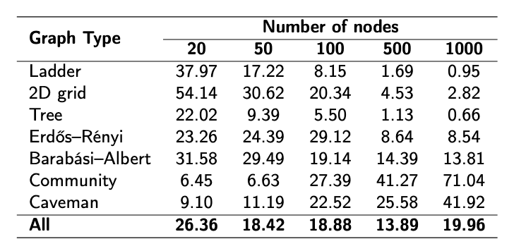
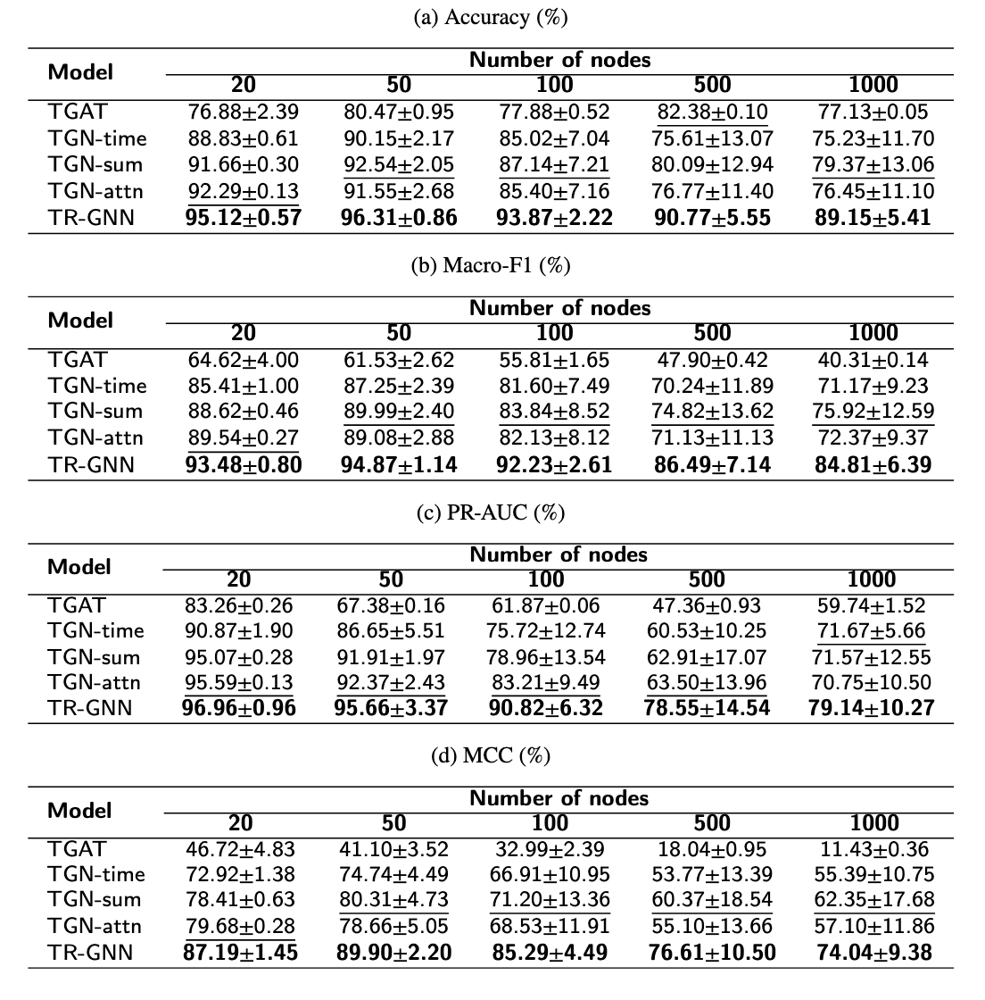

# Paper Implementation
### TR-GNN: Neural Execution for Temporal Reachability Prediction 
> - 석사학위논문
> - [Paper Link](https://sejong.dcollection.net/public_resource/pdf/200000953223_20260710202620.pdf)

### Overview 

  

 

### 평가 데이터셋 정보(Temporal Reachability Ratio)

  

 

### 평가 (Accuracy, Macro-F1, PR-AUC, MCC)

  

